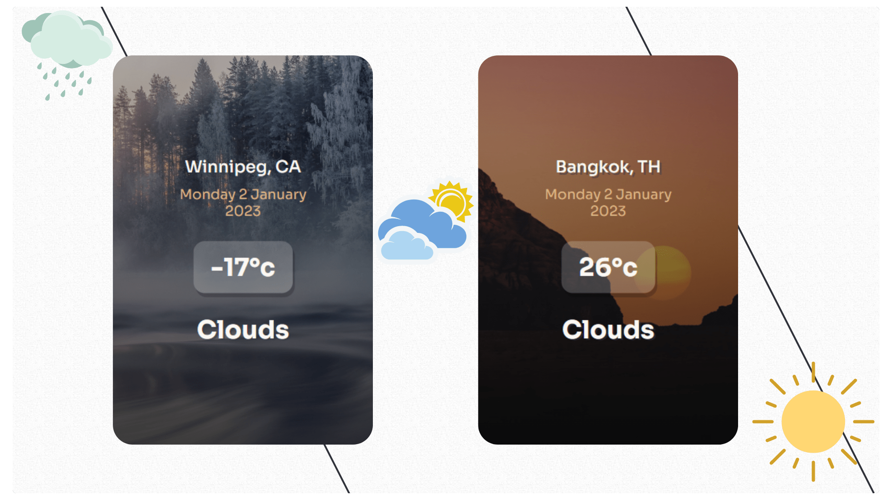

<div align="center">
  <h2 align="center">React Weather App</h2>
  
  
  [](https://twitter.com/intent/follow?screen_name=mabiorduom)
  
  

  This project uses openweathermap api to fetch data that returns city name, date, temperature and weather.

  <a href="https://lucent-weather.netlify.app/"><strong>➥ Live Demo</strong></a>

</div>

### Preview


### Prerequisites
* [Node.Js](https://nodejs.org/) ([Setup Instructions](https://nodejs.org/en/download/package-manager/))

### Getting Started

Create react-app using vite:

```sh
npm create vite@latest weather-app --template React
cd weather-app
```

Install packages and dependencies:

```sh
npm i or npm install
```

Run server:

```sh
npm run dev
```

## License
This project is licensed under the MIT License - see the [LICENSE](LICENSE) file for details
